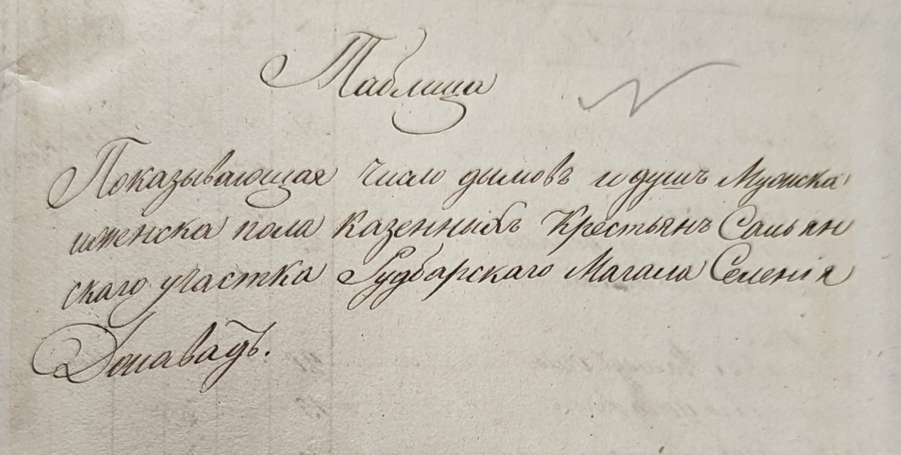
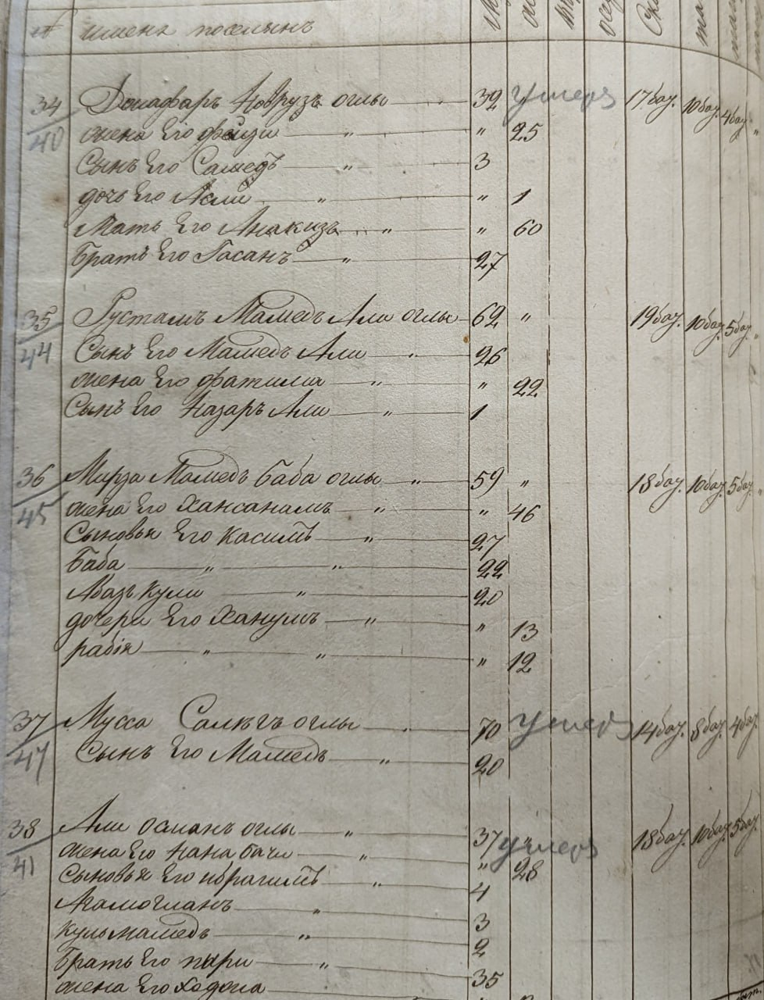
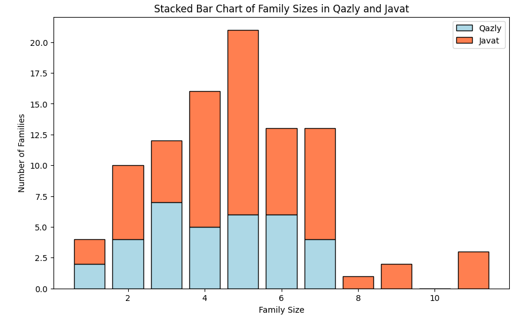

# Rudbar 1842 Census Data Analysis

## Introduction

This project presents a comprehensive analysis of the 1842 census data from the towns of Qazly and Javat in the Rudbar region of the Caucasus. The analysis explores various aspects of demographic and agricultural data, offering insights into the socio-economic structure of these towns during the mid-19th century.

## Manual Data Collection

The original data was manually collected from the Russian Empire census of the Caucasus, capturing vital information about the residents of Qazly and Javat of Rudbar Mahal. The data includes details about household sizes, land ownership, agricultural production, and more.

### Census Book Page




*Pages from the 1842 Rudbar census book.*

### Data Digitization

The data from the census book was transcribed into an Excel file. This step involved manually entering the historical records into a structured format, making it easier to analyze and visualize the data using modern tools.

### Data Analysis with Python

Once the data was digitized into Excel, it was imported into a Python environment for further analysis. Using libraries such as `pandas`, `matplotlib`, `seaborn`, and `numpy`, the data was processed, analyzed, and visualized, providing a deeper understanding of the socio-economic conditions in these towns.

## Project Overview

This Jupyter notebook is designed to process, analyze, and visualize the census data using Python. The analysis includes:

- **Population Distribution**: Examination of household sizes, with visualizations showing the distribution of family sizes in both towns.
- **Arable Land Ownership**: Comparative analysis of land ownership, highlighting differences in the amount of arable land per household and per capita.
- **Agricultural Production**: Analysis of wheat and barley production, including total and per capita statistics.
- **Common Names and Occupations**: Word clouds and frequency analysis to visualize the most common names and occupations in Qazly and Javat.
- **Age Distribution**: Statistical analysis and visualizations to explore the age distribution and its correlation with land ownership.

## Libraries Used

- **pandas**: For data manipulation and analysis.
- **matplotlib**: For creating static, animated, and interactive visualizations.
- **seaborn**: For statistical data visualization based on matplotlib.
- **numpy**: For numerical operations and array handling.
- **wordcloud**: For generating word clouds to visualize common names and occupations.

## How to Run

1. **Clone the Repository**:
   ```bash
   git clone https://github.com/yourusername/Rudbar1842CensusAnalysis.git
   cd Rudbar1842CensusAnalysis
2. **Install the Required Libraries**:
    ```bash
    pip install pandas matplotlib seaborn numpy wordcloud
3. **Open the Jupyter Notebook**:
   ```bash
   jupyter notebook RudbarAnalysis.ipynb
4. **Run the Notebook**:
   Execute all the cells to reproduce the analysis and visualizations.

  ### Visualizations

The notebook contains several visualizations, including:

- Stacked bar charts comparing family sizes.
- Density plots for arable land distribution.
- Word clouds showing the most common names and occupations.

These visualizations provide a clear and insightful understanding of the data.

### Example Visualizations

This section highlights a sample visualization generated from the analysis of the 1842 census data. 
Below is a visualization comparing the family sizes in the towns of Qazly and Javat.



*This bar chart shows the distribution of family sizes in Qazly and Javat, illustrating the demographic structure of each town.*

### Contribution

Contributions are welcome! If you find any issues or have suggestions for improvements, feel free to open an issue or submit a pull request.

### License

This project is licensed under the MIT License.

### Acknowledgments

Special thanks to the resources and tools provided by the Python data science community.


